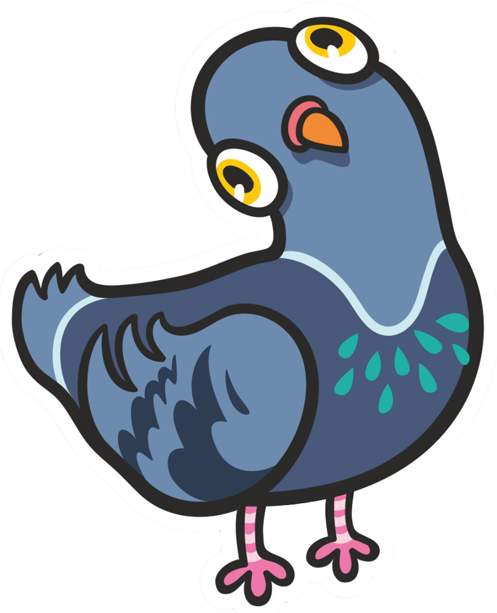

# PIGEON'S ATTACK

## Description
Become a mischievous pigeon in this fun and fast-paced game where you drop poop on unsuspecting targets below! Hit slow-moving targets like the grandma for fewer points, or aim for the speedy convertible to earn big rewards. But watch out—the rooftop isn’t safe! A sneaky cat is lurking, and if it catches you, it’s game over. Dodge the cat, aim carefully, and rack up points to become the city’s most notorious pigeon. Are you ready for the challenge?

## Main Functionalities
- Pigeon can move left and right by clicking `A` or `D`.
- Pigeon can jump by clicking `W`.
- You can shoot targets by clicking `S`.
- Targets move automatically and appear on screen randomly.
- There are 5 different targets, each with a different speed.
- The fastest target gives 5 points, while the slowest one gives only 1 point.
- Enemies show up randomly from the right; the player must dodge them by jumping.
- Getting hit by an enemy makes you lose the game.

## Backlog Functionalities
- More enemies will show up.
- Life system for multiple chances.

## Technologies Used
- HTML
- CSS
- JavaScript
- DOM Manipulation
- JavaScript Classes
- Local Storage
- JavaScript Audio

## Game States
- Start Game
- Game Screen
- Game Over Screen

## Extra Links
- **Slides**: [Link](#)
- **Deploy**: [Link](#)